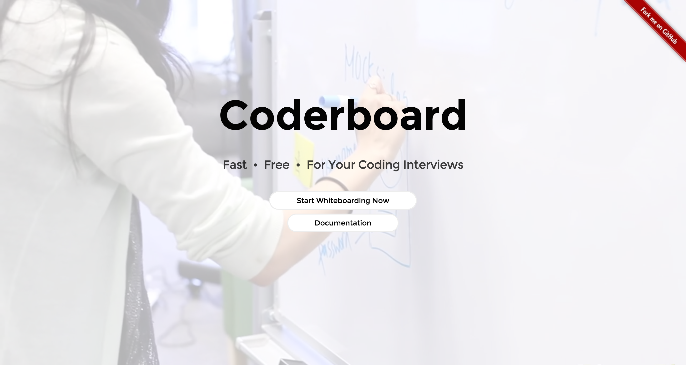

# Coderboard
[See it live here!](https://coder-board.herokuapp.com/)



## Table of Contents

1. [Documentation](#Documentation)
2. [Usage](#Usage)
3. [Requirements](#Requirements)
4. [Development](#development)
    1. [Installing Dependencies](#installing-dependencies)
    2. [Packaging Documentation](#packaging-documentation)
5. [Team](#team)
6. [Contributing](#contributing)

## Documentation

View the documentation [here](http://hidden-castle-8290.herokuapp.com/documentation)

## Usage

> Simple-to-use, responsive, real-time whiteboard app. Play pictionary with your friends, or conduct a grueling 2-hour algorithm interview. The choice is yours.

## Requirements

- Node 0.12.0
- Express 4.13.3
- Angular 1.4.7
- Mongoose 4.2.5
- Socket.io 1.3.7
- Grunt-Docco 0.4.0
- Body-Parser 1.14.1


## Development

### Installing Dependencies

From within the root directory:

```sh
npm install
```

### Packaging Documentation

From within the root directory:

```sh
grunt docco
```

## Team

  - __Product Owner__: [Clayton Schneider](https://github.com/claytonschneider)
  - __Scrum Master__: [Stephen Wu](https://github.com/thedeagler)
  - __Development Team Members__: [Mitchell Wilcox](https://github.com/j3tman), [Michelle Lee](https://github.com/mi-lee)


## Contributing

See [CONTRIBUTING.md](CONTRIBUTING.md) for contribution guidelines.
